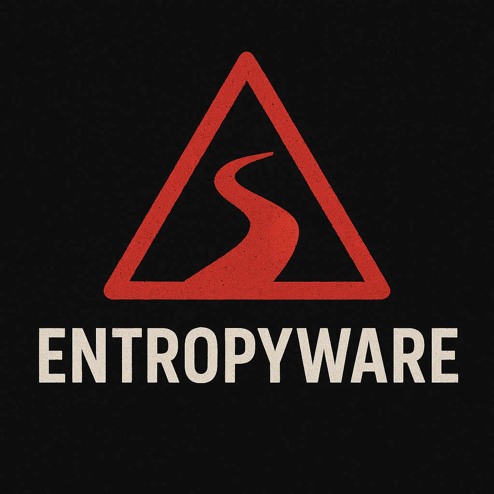

<div align="center">
  <a href="https://github.com/vinchiqqq-byte/EntropyWare">
    
  </a>

  <h3 align="center">EntropyWare</h3>

  <p align="center">
    An custom OS written on C, C++!
    <br />
    <a href="https://github.com/vinchiqqq-byte/EntropyWare"><strong>Explore the docs »</strong></a>
    <br />
    <br />
    <a href="https://github.com/vinchiqqq-byte/EntropyWare">View Demo</a>
    &middot;
    <a href="https://github.com/vinchiqqq-byte/EntropyWare/issues">Report Bug</a>
    &middot;
    <a href="https://github.com/othneildrew/Best-README-Template/issues/new?labels=enhancement&template=feature-request---.md">Request Feature</a>
  </p>
</div>


## Description

Right now, project stil in development, expect many thiings to change,
bugs and more

## Getting Started

* Download an .img file in releases
* Plug the USB drive and flash it

### Executing OS

* Dont forget to turn on legacy boot!
* Insert the usb drive
* Boot into the USB drive
* Type ¨help¨ for a list of commands
* Follow the instructions on screen (placeholder)

```
help
```

## Authors

-Main developer

https://github.com/vinchiqqq-byte

-Help with code (I really appreciate it, youre the best)

https://github.com/terra-fx-t-byte

-Image

https://chatgpt.com
